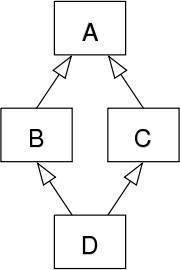

# 다중상속이란?

* 위키정의 : 어떤 클래스가 하나 이상의 상위 클래스로부터 여러 가지 행동이나 특징을 상속받을 수 있는 것을 말한다
* 다중 상속을 지원하는 언어는 다음과 같다
    *  C++
    * Common Lisp 
    * EuLisp
    * Curl
    * Dylan
    * Eiffel
    * Logtalk
    * Object REXX
    * 스칼라
    * Objective Caml
    * 펄
    * 파이썬


# 다중상속 문제

## 1. 다이아몬드 문제




* 클래스 A에서 파생되는 클래스 B와 C가 있다고 가정
* 그리고 C++ 상속(다이아몬드를 유발하는 다중 상속)으로 클래스 B와 C의 파생 클래스 D도 생성.

```
class A {}; // base class
{
    int n;
 
    public:
        int print() { return n;};
};
 
class B : public A {};
class C : public A {}    
class D : public B, public C {};

/*****************************************/
//
// 위의 코드가 C++ 상속, 다이아몬드 문제를 유발하는 실제 예시
// 
/*****************************************/

int main( )
{
    D d;
    --COMPILE ERROR--
    int n = d.print();
}

/*****************************************/
//
// C++ 상속되는 계층 구조에서 B, C 클래스 모두 A 기본 클래스에서 파생되는 것
// 
/*****************************************/
```

> A 클래스에서 B, C 클래스가 파생됨.
> 두 클래스 모두 A 클래스의 멤버 데이터와 함수를 가짐.
> 그래서 위의 코드에선 print에 대한 호출이 "모호(ambiguous)"해서 컴파일러는 정상적으로 수행되지 못함

## 2. 그럼에도 불구하고....
* 모듈 또는 라이브러리 합치기 위해서 사용
* 두개의 독립적인 라이브러리에 있는 클래스를 각각 1개씩 상속하여, 하나의 클래스를 만들고자 할때는 유용하게 사용 될 수 있음


# java8 default method 와 다중상속

* default method 가 뭔지는 찾아보도록

## 1. 유연함 + 다중상속
```
/**
 * 비행을 할 수 있는 인터페이스 명시.
 *
 *
 */

public interface IFlyable {
    /**
     * 날 수 있는 방법 명시.
     */
    void fly();
    
    /**
     * 음식으로 변환 
     * @return
     */
    default Object toFoodObject() {
        return new FoodByFlyAble();
    }
}
 
public interface IRunable {
    /**
     *  달릴 수 있는 방법 명시.
     */
    void run();
    
    /**
     * 음식으로 변환
     * @return
     */
    default Object toFoodObject() {
        return new FoodByFRunAble();
    }
}
 
/**
 * 닭 클래스 정의
 * 
 */
public class Chicken implements IFlyable, IRunable{
 
    @Override
    public void fly() {
        System.out.println("30 m 점프");
    }
    
    @Override
    public void run() {
        System.out.println("열심히 뛰어");
    }
}
```

> 위 코드에서 Chicken 클래스가 toFoodObject() 를 사용할 경우 어떤 interface의 default method 를 사용하는 것일까?


## 2. 회피 규칙
### 1 클래스에서 default method를 재정의 한다면, 클래스가 우선

* Chicken 클래스에서 아래와 같이 toFoodObject() 를 재정

```
public class Chicken implements IFlyable, IRunable{
 
    @Override
    public void fly() {
        System.out.println("30 m 점프");
    }
    
    @Override
    public void    run() {
        System.out.println("열심히 뛰어");
    }
    
    /**
     * toFoodObject 을 재정의!!
     */
    @Override
    public Object toFoodObject() {
        return new FrenchStyleChiken();
    }
}
```

### 2.Sub interface 가 디폴트 메소드 재정의한다면, sub interface 가 우선

* interface 간 상속구조가 존재하고, sub interface 가 부모 interface 의 디폴트 메소드를 재정의한다면, 아래와 같이 sub interface 디폴트 메소드가 실행

```
/**
 * 비행을 할 수 있는 인터페이스 명시.
 *
 */
 interface IFlyable {
    /**
     * 날 수 있는 방법 명시.
     */
    void fly();
    
    /**
     * 음식으로 변환 
     * @return
     */
    default Object toFoodObject() {
        return new FoodByFlyAble();
    }
}
 
 interface IRunable extends IFlyable{
    /**
     *  수 있는 방법 명시.
     */
    void run();
    
    /**
     * 음식으로 변환 
     * @return
     */
    @Override
    default Object toFoodObject() {
        return new FoodByFRunAble();
    }
}
 
/**
 * 닭 클래스 정의
 *
 */
 class Chicken implements IRunable{
 
    @Override
    public void fly() {
        System.out.println("30 m 점프");
    }
    
    @Override
    public void run() {
        System.out.println("열심히 뛰어");
    }
}
 
System.out.println(chicken.toString());
 
// Return
// FoodByRunnable 

```

### 3. 디폴트 메소드의 우선순위가 결정되지 않았다면, 명시적 선언이 우선
* 1, 2 번 규칙에 의해서 여전히 디폴트 메소드의 우선순위가 결정되지 않았다면 상속대상이 되는 클래스에서 어떤 메소드를 사용할지 명시적으로 선언해야 함.


* JAVA8 에서는 인터페이스의 디폴트 메소드를 명시적으로 선언하기 위해서, 아래와 같은 문법을 지원함
> InterfaceName.super.method(...) 

```
/*
 * 닭 클래스 정의
 *
 */
 public class Chicken implements IRunable, IFlyable{
 
    @Override
    public void fly() {
        System.out.println("30 m 점프");
    }
    
    @Override
    public void run() {
        System.out.println("열심히 뛰어");
    }
    
    @Override
    public Object toFoodObject() {
        return IRunable.super.toFoodObject();
    }
}
```